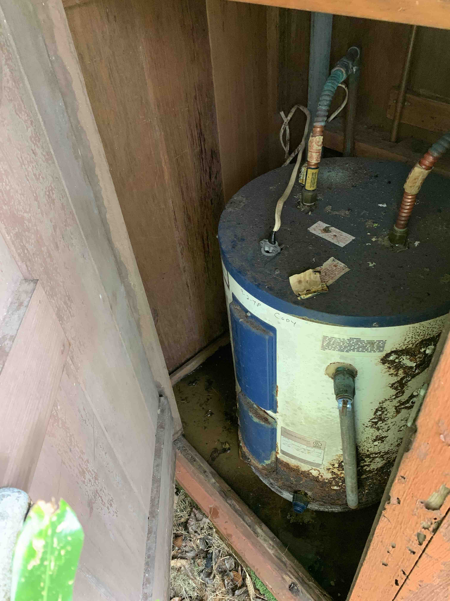
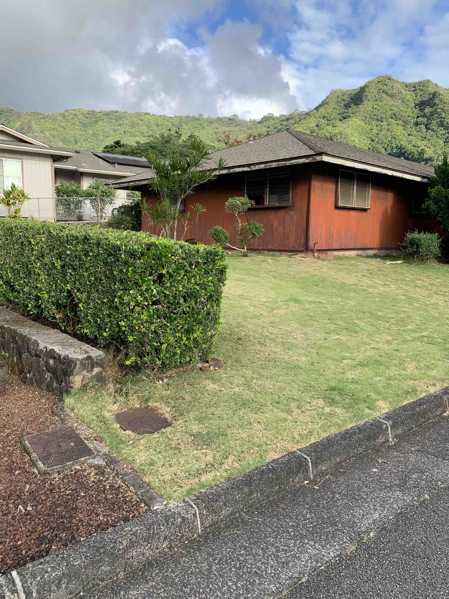
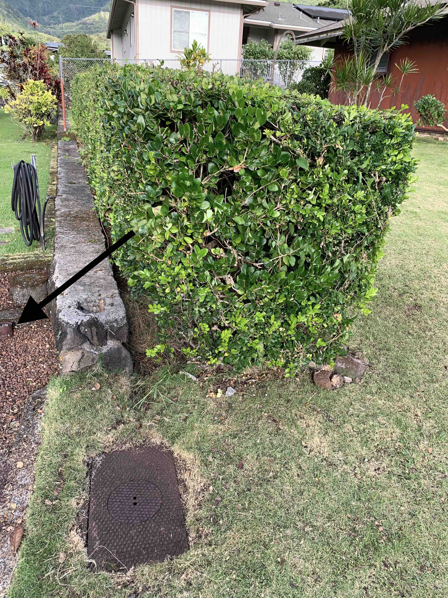
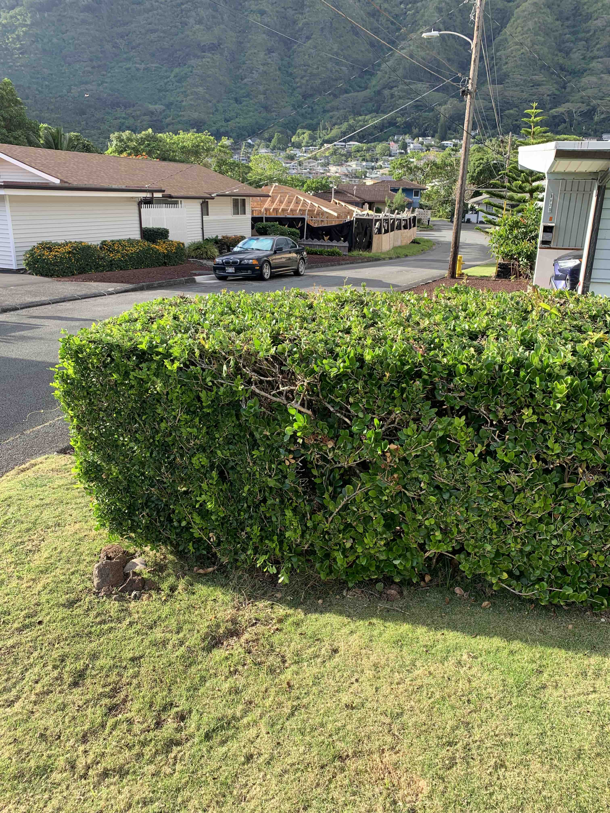
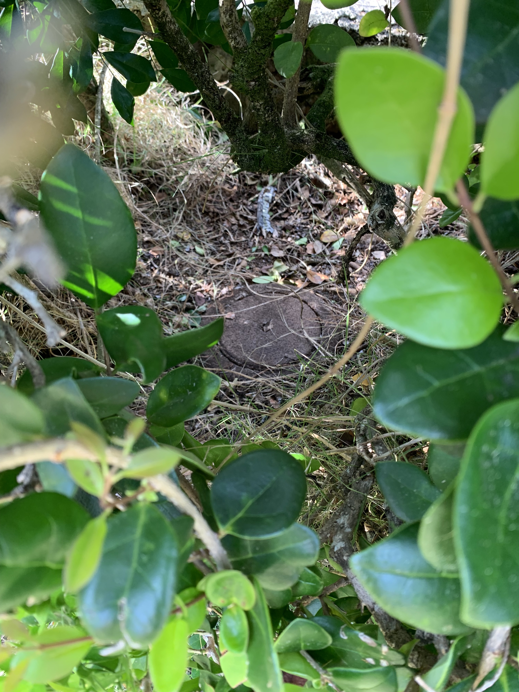

They say that everyone should know where their water shutoff valve is. What if this happens:

<!--  -->

That's a leaking water heater at E Manoa Road. You might say 'just call a plumber'. Well, what if it's Sunday afternoon? 

You might say 'I'll just shut of the intake valve to the water heater'. But what if the water heater is really old and the shutoff valve doesn't work?

These things really happen!

The ultimate solution to any flooding problem in your house is to shut off the main water supply to the property. Every property has one of these. I'm going to show you where the shutoff is at East Manoa. You might be surprised!

Here is the house from the southeast: 

You might notice two rectangular objects. Those are the 'service boxes' maintained and owned by the Board of Water Supply. You can lift the lid and read your meter but you can't turn the water off here. No No NO! Only the Board of Water Supply can do this. 

Here's another view of the service box from a slightly different angle. 

In the foreground is your service box. If you look very closely to the left of the photo you will see a small brownish cylinder in front of two larger grey cylinders. This is the neighbors shut-off valve. Now you might say 'I don't want to turn off my neighbor's water', and you would be right! But if the neighbor's shut-off is there, then yours must be in a similar position, right? 

Yes!

If you place your feet over the neighbor's shut-off and look east, you will see this: 

That's the container for you shutoff valve, hidden in the bushes! Who planted bushes there? How am I supposed to find my shutoff valve if people cover it in the landscape? That's a very good question. 

In any case, there it is. If you look from the East you will see this: 

Look closer and you will see: 

There's the shutoff valve again!

I don't have picture of the inside of this valve for you, but lift up the top of that cylinder and you see a very familiar shutoff valve, much like the ones you see on outdoor hose connection. Turn it clockwise as far as you can - your water should stop flowing and your bathroom should stop flooding. 

Or not! At the East Manoa house this valve failed too! That's unusual - really, trust me - but it did happen in this case. It's an old house. If that does happen you call the Board of Water Supply and report a 'water emergency'. If you lucky like me they'll shut your water off in about two hours. 

Those of you who used to clean yard probably know this already. But in any case, now  you know where the E Manoa water shutoff valve is!

DH

